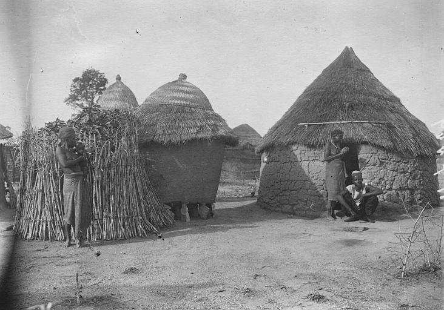
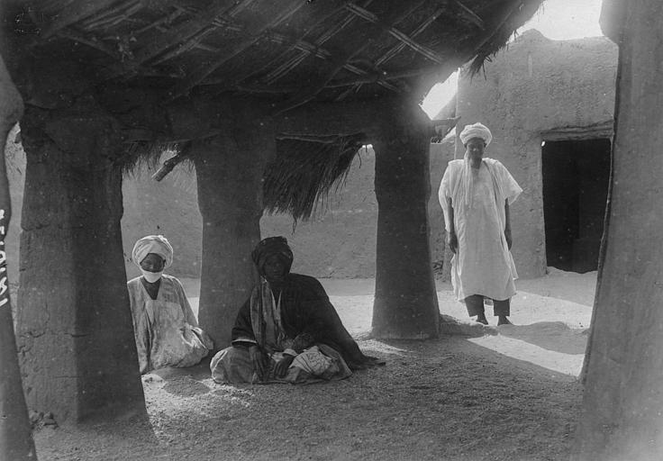
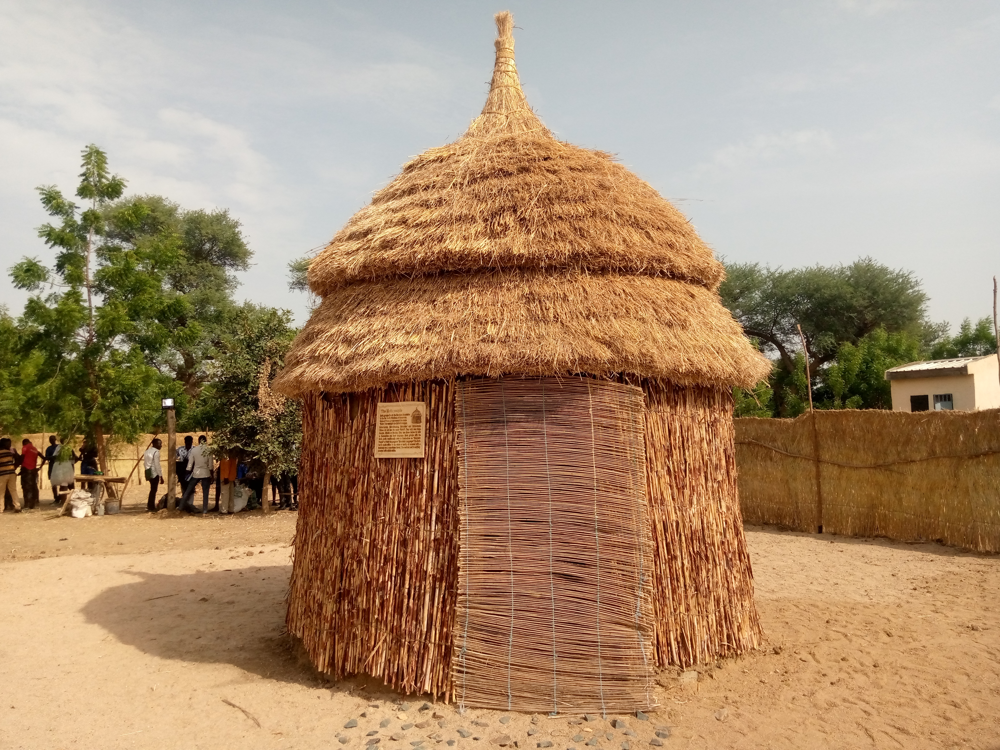
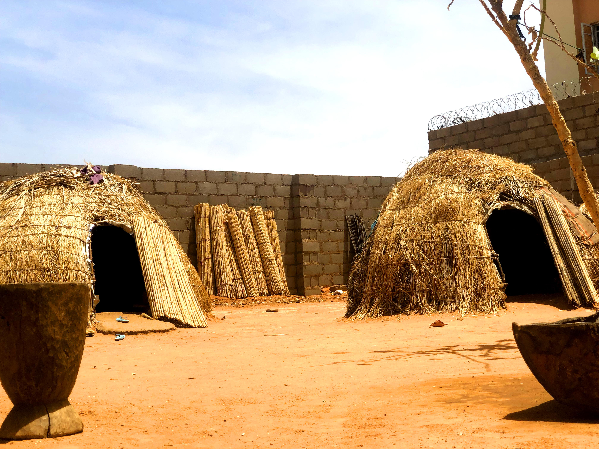
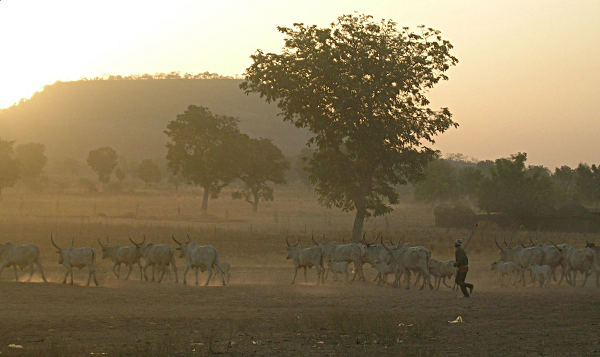

# Corpus iconographique annoté

## Statut de ce document

Cinq photographies, sélectionnées et vérifiées individuellement (source, licence, correspondance entre la description déclarée et le contenu réel de l'image) avant intégration. Une sixième source initialement retenue (*Nyorgo Maroua*) a été écartée après vérification : l'image ne correspondait pas à sa description déclarée — voir la note dans le corpus documentaire pour la traçabilité de cette décision.

Ces photographies ne remplacent pas une enquête de terrain : ce sont des repères visuels externes, à traiter avec la même prudence méthodologique que le reste du corpus — voir la note éthique pour la distinction entre données attestées et reconstitutions.

## Galle — architecture sédentaire (fonds historique, 1918)

**Source** : Frédéric Gadmer, Médiathèque de l'architecture et du patrimoine (fonds de la Première Guerre mondiale), via data.gouv.fr. Licence Ouverte 1.0 / CC-BY-SA 4.0.

**Annotation** : la photographie montre plusieurs cases coiffées d'un toit conique de paille, avec des bottes de paille brute empilées à côté d'une case en cours de construction ou de réfection — une preuve visuelle concrète du matériau de couverture (seygoore) avant tressage, à un stade que la documentation textuelle du projet ne couvrait pas. Le mur en banco de la case la plus à droite présente un relief géométrique décoratif : une piste de recherche à noter plutôt qu'une généralisation, une seule photographie ne suffisant pas à établir que ce motif est systématique.

**Source** : Frédéric Gadmer, Médiathèque de l'architecture et du patrimoine, via data.gouv.fr. Licence Ouverte 1.0 / CC-BY-SA 4.0.

**Annotation** : porche d'entrée à piliers de bois massif soutenant un avant-toit de paille, avec un homme âgé en boubou blanc et deux personnes assises à l'ombre — vraisemblablement la zone d'accueil/de sociabilité en entrée de concession décrite dans le schéma annoté (dudal ou espace équivalent). Les piliers en troncs bruts, une construction destinée à durer, confirment visuellement la distinction structurelle entre le galle sédentaire et l'armature en branches arquées, démontable, du wuro nomade.

## Galle — reconstitution contemporaine (2023)

**Source** : Abdouraman Mana 33, Wikimedia Commons (Wiki Loves Folklore 2024). CC0.

**Annotation** : contrairement aux deux photographies précédentes, il s'agit d'une construction de démonstration récente — une plaque et un public visible à l'arrière-plan indiquent un contexte d'exposition patrimoniale plutôt qu'une habitation occupée. Utile pour confirmer les matériaux de construction (paille, bois, tiges de mil, selon la description de l'auteur) et la silhouette actuelle du toit conique, mais à ne pas lire comme un document ethnographique de la vie quotidienne — distinction que la méthodologie du projet retient systématiquement.

## Wuro — référence régionale peule élargie

**Source** : Gidadorabia, Wikimedia Commons (Wiki Loves Africa 2023, thème Climat & Météo). CC-BY-SA 4.0.

**Annotation** : les métadonnées Commons situent cette photographie au Nigeria, pas au Cameroun — elle est donc retenue comme référence régionale peule élargie, pas comme source spécifique à l'Extrême-Nord camerounais visé par le projet. Les deux dômes de paille dans une concession close par un mur en parpaing illustrent une adaptation semi-urbaine du wuro nomade, distincte du campement pleinement mobile modélisé dans ce projet — un écart à garder en tête plutôt qu'à effacer.

## Troupeau — pastoralisme

**Source** : Philou.cn (Flickr), reviewé et confirmé CC-BY-SA 2.0 par FlickreviewR sur Wikimedia Commons.

**Annotation** : troupeau de zébus à cornes en lyre mené par un berger à travers une savane poussiéreuse, en lumière rasante de fin de journée. Les cornes en lyre et la robe claire visibles à cette distance corroborent la morphologie générale ciblée dans le module troupeau, sans permettre de vérifier le détail de la bosse à cette résolution. La formation allongée et lâche du troupeau, avec le berger positionné en retrait sur le côté plutôt qu'en tête, est une référence utile pour la mise en scène du déplacement animé dans la scène Unity, plutôt qu'un simple tableau statique.
